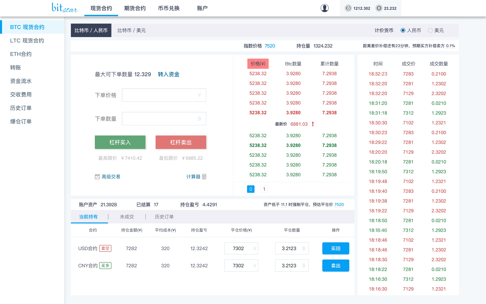
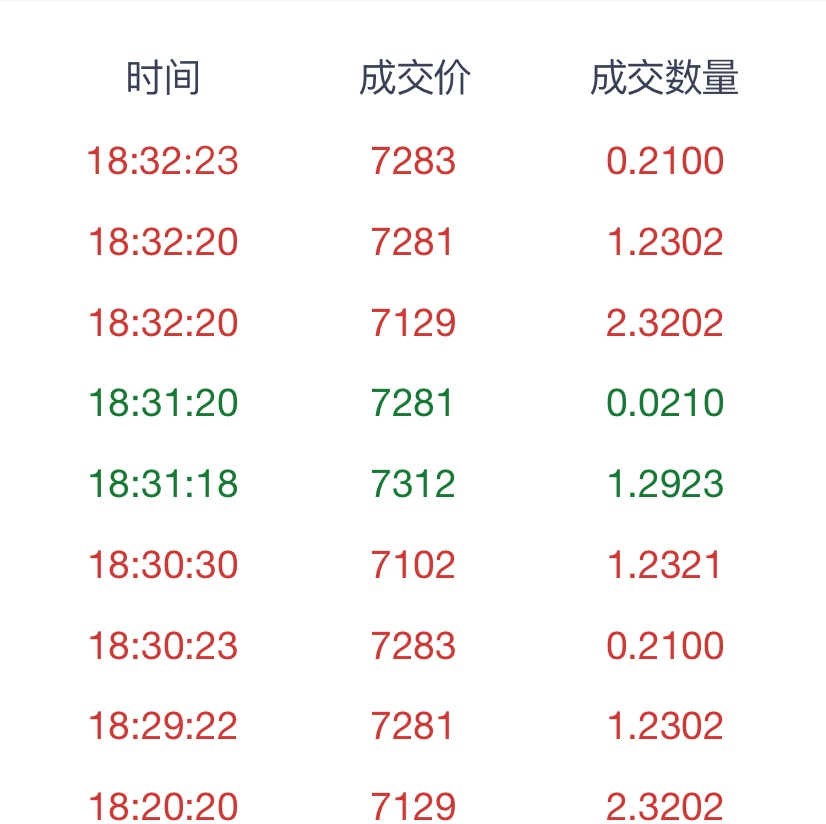
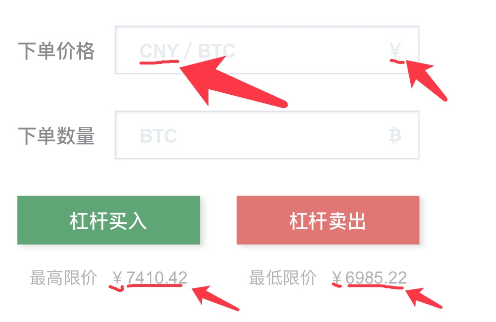
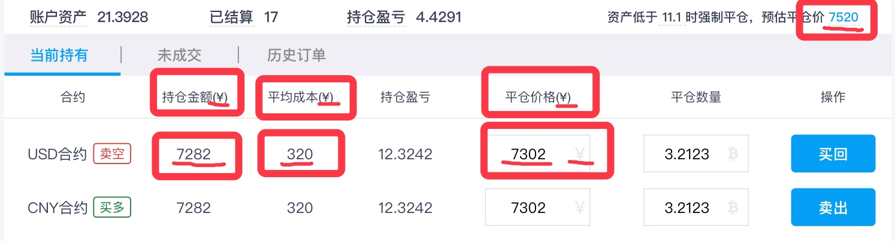
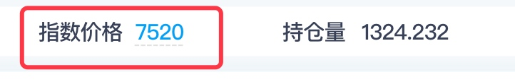
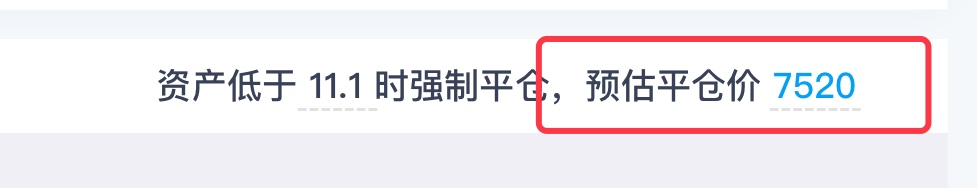
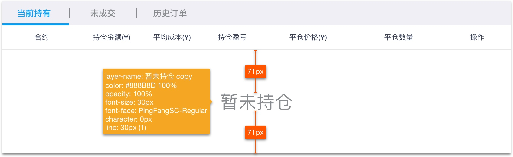
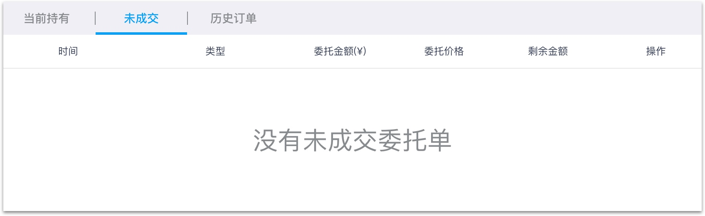
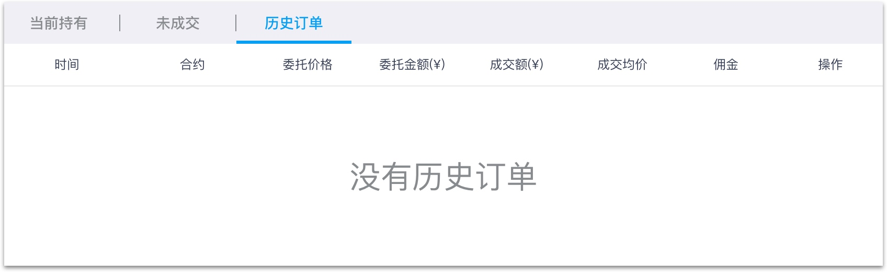
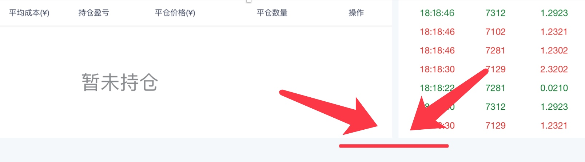

#现货合约主界面注意事项（4-17）

## **1.美元与人民币的单位精确位数**
> a.人民币:小数点后一位  eg：23.4
b.美元：小数点往后精确两位  eg：23.38
c.卖买输入与计算：（该改动不影响界面显示，后期添加具体说明。）

## **2.刷新差价补偿时间显示方式<界面右上角>**
> 倒计时原理：
 	a.从“8小时”到“1小时”之间的倒计时：只显示小时整数。（图一）
 	b.最后一小时的倒计时：显示分钟数。（图二）
 	c.鼠标悬停在“倒计时”与“百分比”的数字界面要显示出对应细节说明。

图一👇：
    
图二👇：

-------

##  **3.“计价单位“选择后（界面与数据）变动详情**

> **a.默认优先级：**
> 浏览器使用记录>IP地址
> **b.进入的币种：**
 点击人民币=默认选中人民币
 点击美元=默认选中美元
> **c.点击币种后要变化的数据（截图说明）**
> >   
-------
> > 01.买卖盘上的价格数字与单位：
> > ![](https://pic4.zhimg.com/v2-aad639b5b5073a2ce48619d85917196f_540x450%7Cadx4.jpg> 
-------

Markdown
>  02.交易记录的价格单位变化：
> 
> 
-------

03.买卖操作模块的对应**单位、数据、图片**要进行替换

-------

04.操作记录中对应**单位、数据、图片**要进行替换.

-------
05.数据同步（顶部的指数价格与预估平仓价的数值保持一直同步）：

-------
##  **4.界面下方无订单样式👇**
·当前持有：
·未成交：

·历史订单：
*⚠️：在没有任何下单的情况下要保证底部的“订单模块”和右侧的“历史记录模块底部相平”。如下图👇

